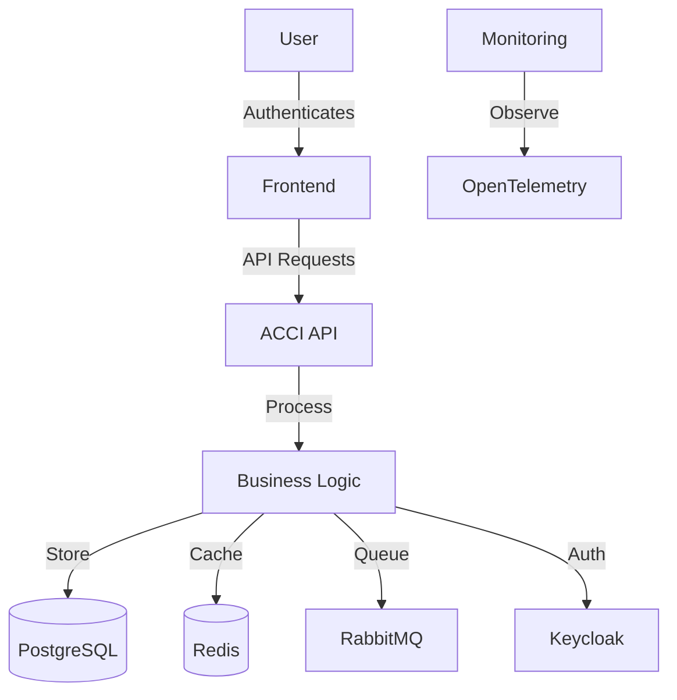
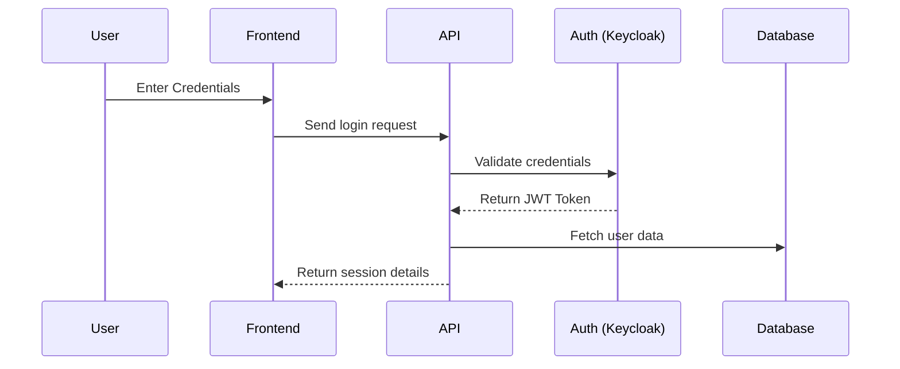

# arc42 Software Architecture Documentation – ACCI Project

## 1. Introduction & Goals

### 1.1 Requirements & Goals

The ACCI project is an **enterprise-grade Rust-based system** designed for **secure multi-tenancy, high scalability, and compliance**.  
The key goals of the project are:

- **Secure authentication & authorization** (OAuth2, OpenID Connect, RBAC)
- **Multi-tenancy support** with strict tenant isolation
- **High-performance API** (REST & GraphQL)
- **Enterprise license management**
- **Observability & Monitoring** (OpenTelemetry, Prometheus, Grafana)
- **Resilient infrastructure** (Docker, Kubernetes, Zero-downtime deployments)

### 1.2 Stakeholders

| **Stakeholder**   | **Role** |
|------------------|----------|
| Project Managers | Oversee development progress, ensure roadmap adherence |
| Developers | Implement core system functionality |
| DevOps Engineers | Manage CI/CD, infrastructure, and deployment |
| Security Team | Ensure compliance with security best practices |
| End Users | Access the system as authenticated tenants |
| Compliance Officers | Verify adherence to ISO 27001, GDPR |

---

## 2. Constraints

### 2.1 Technical Constraints

- **Rust-based backend** using **Axum & async-graphql**
- **PostgreSQL** as the primary database with **pgvector for AI capabilities**
- **Redis 7.2 for caching**
- **RabbitMQ 3.12 for messaging**
- **Keycloak for identity management**
- **Docker & Kubernetes for deployments**

### 2.2 Organizational Constraints

- **Project documentation must be available in EN, DE, SQ**
- **CI/CD must include security scans & compliance checks**
- **Deployment must support zero-downtime rollouts**

---

## 3. System Scope & Context

### 3.1 Business Context

ACCI is a multi-tenant **enterprise SaaS platform**. It provides:

- **Authentication & Role Management**
- **Feature-based access control**
- **API rate limiting & monitoring**
- **Enterprise licensing & tenant management**

**External Interfaces:**

- **Users** authenticate via a web frontend
- **Third-party services** interact via REST & GraphQL APIs
- **Monitoring tools** collect logs & metrics (OpenTelemetry, Prometheus)

### 3.2 Technical Context



---

## 4. Solution Strategy

- **Domain-Driven Design (DDD) & Hexagonal Architecture**
- **CQRS & Event Sourcing for scalability**
- **REST & GraphQL APIs for flexibility**
- **Multi-stage CI/CD pipeline for automated testing & deployment**
- **SBOM (Software Bill of Materials) for supply chain security**
- **Automated security audits & compliance enforcement**

---

## 5. Building Block View

```text
root
├── acci-api (REST & GraphQL endpoints)
├── acci-core (Business logic, authentication, multi-tenancy)
├── acci-db (Database access & repository layer)
├── acci-auth (Authentication & role management)
├── acci-frontend (Web interface)
├── acci-observability (Logging & monitoring)
```

---

## 6. Runtime View

### 6.1 User Login Flow



---

## 7. Deployment View

| **Environment** | **Technology** |
|---------------|---------------|
| **Development** | Docker Compose |
| **Staging** | Kubernetes on AWS |
| **Production** | Kubernetes with Traefik |

---

## 8. Cross-Cutting Concepts

### **Security**

- **OAuth2 & OpenID Connect for authentication**
- **Role-based access control (RBAC)**
- **Multi-factor authentication (TOTP, WebAuthn)**
- **Data encryption (AES-256)**
- **PII data masking**

### **Observability**

- **Tracing with OpenTelemetry**
- **Metrics with Prometheus**
- **Logging with Loki & Grafana dashboards**

---

## 9. Architecture Decisions

| **Decision** | **Rationale** | **Status** |
|-------------|--------------|-----------|
| Use Rust & Axum | High performance, memory safety | ✅ Approved |
| Use PostgreSQL | Relational consistency, scalability | ✅ Approved |
| Use Keycloak | Enterprise-grade identity management | ✅ Approved |
| Use Event Sourcing | Scalability & auditability | ✅ Approved |

---

## 10. Quality Requirements

| **Category** | **Requirement** |
|-------------|--------------|
| **Performance** | API response time < 100ms |
| **Scalability** | Supports 100k+ concurrent users |
| **Security** | OWASP Top 10 compliance |
| **Compliance** | ISO 27001 & GDPR adherence |
| **Availability** | 99.99% uptime requirement |

---

## 11. Risks & Technical Debt

| **Risk** | **Impact** | **Mitigation** |
|---------|-----------|--------------|
| **Multi-tenancy complexity** | High | Tenant partitioning & resource tracking |
| **Security vulnerabilities** | Critical | Regular audits & automated security scans |
| **Database scaling** | Medium | Sharding & read replicas |
| **CI/CD bottlenecks** | Medium | Parallel test execution & caching |

---

## 12. Glossary

| **Term** | **Definition** |
|---------|--------------|
| **RBAC** | Role-Based Access Control |
| **JWT** | JSON Web Token |
| **SBOM** | Software Bill of Materials |
| **CQRS** | Command Query Responsibility Segregation |

---

## Next Steps

- **Review architecture documentation with the team**
- **Implement additional quality assurance testing**
- **Optimize CI/CD performance & monitoring**
