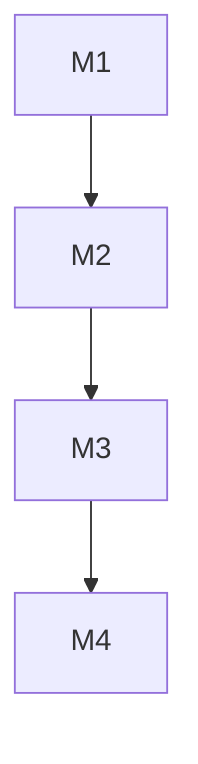

# Project Milestones

## Overview

This document defines the key milestones for developing our enterprise-grade Rust-based system. The milestones are structured following an MVP (Minimum Viable Product) approach, with clear phases for iterative development and delivery.

## MVP Phase (M1)

**Timeframe**: 2-3 weeks

### M1.1: Core Infrastructure (Week 1)

- [ ] Basic repository setup
  - GitHub repository structure
  - Development environment (Docker)
  - Basic linting setup
- [ ] CI/CD foundation
  - Simple GitHub Actions pipeline
  - Basic test automation

### M1.2: MVP Backend (Week 1-2)

- [ ] Basic Axum setup
  - Health check endpoint
  - Basic error handling
- [ ] Database integration
  - PostgreSQL setup
  - Simple user table
- [ ] Simple authentication
  - Basic login endpoint
  - Hardcoded test user
- [ ] Basic license validation
  - Simple license key check
  - Basic feature flag system

### M1.3: MVP Frontend (Week 2-3)

- [ ] Basic Leptos setup
  - Project structure
  - Simple routing
- [ ] Minimal UI
  - Login form
  - Basic layout
  - Success page after login

## Phase 2: Core Features (M2)

**Timeframe**: 6-8 weeks

### M2.1: Enhanced Security (Week 1-2)

- [ ] Multi-factor authentication
- [ ] RBAC implementation
- [ ] API key management
- [ ] Security headers
- [ ] SBOM generation (CycloneDX)

### M2.2: Multi-tenancy (Week 3-4)

- [ ] Tenant isolation
- [ ] Tenant-specific configuration
- [ ] Database partitioning
- [ ] Tenant onboarding

### M2.3: API Enhancement (Week 5-6)

- [ ] REST API expansion
- [ ] GraphQL integration
- [ ] API documentation (OpenAPI)
- [ ] Rate limiting
- [ ] API versioning

### M2.4: Observability (Week 7-8)

- [ ] OpenTelemetry integration
- [ ] Prometheus metrics
- [ ] Grafana dashboards
- [ ] Distributed tracing
- [ ] Enhanced logging

## Phase 3: Enterprise Features (M3)

**Timeframe**: 6-8 weeks

### M3.1: Advanced Features

- [ ] Event sourcing
- [ ] CQRS implementation
- [ ] Workflow engine
- [ ] Plugin architecture

### M3.2: Performance & Scaling

- [ ] Caching strategy
- [ ] Load balancing
- [ ] Auto-scaling
- [ ] Performance optimization

### M3.3: Advanced Security

- [ ] End-to-end encryption
- [ ] PII data masking
- [ ] Advanced audit logging
- [ ] Compliance reporting

### M3.4: License Management System

- [ ] Enterprise License Management
  - [ ] License key generation infrastructure
  - [ ] Time-based license validation
  - [ ] Feature-based access control
  - [ ] Offline validation support
  - [ ] License renewal workflow
  - [ ] Usage analytics and reporting

- [ ] Multi-tenant Feature Control
  - [ ] Tenant feature configuration system
  - [ ] Quota management implementation
  - [ ] Resource tracking and analytics
  - [ ] Tenant-specific policy engine
  - [ ] Billing integration framework

## Phase 4: Production Readiness (M4)

**Timeframe**: 4-6 weeks

### M4.1: Production Infrastructure

- [ ] Production Docker setup
- [ ] Zero-downtime deployment
- [ ] Backup strategy
- [ ] Disaster recovery

### M4.2: Documentation & Training

- [ ] Operations manual
- [ ] API documentation
- [ ] Developer guides
- [ ] Training materials

## Questions to Clarify

1. Are there specific MVP features that should be prioritized?
2. What are the minimal security requirements for the MVP?
3. Are there existing systems to integrate with in the MVP phase?
4. What are the basic performance requirements for the MVP?

## Notes

- All milestones follow best practices from `.cursorrules`
- Each milestone requires complete documentation
- Code reviews are mandatory
- Automated tests are required
- Regular security audits
- Continuous performance monitoring

## Dependencies

## MVP Success Criteria

1. Test user can log in through the UI
2. Successful login redirects to a simple success page
3. Basic error handling works
4. Simple deployment works
5. Basic documentation exists
