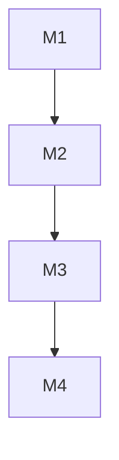

# Project Milestones

## Overview

This document defines the key milestones for developing our enterprise-grade Rust-based system. The milestones are structured following an MVP (Minimum Viable Product) approach, with clear phases for iterative development and delivery.

## MVP Phase (M1)

**Timeframe**: 2-3 weeks

### M1.1: Core Infrastructure ✅

- [x] Basic repository setup ✅
  - [x] GitHub repository structure ✅
  - [x] Development environment (Docker) ✅
  - [x] Basic linting setup ✅
- [x] CI/CD foundation ✅
  - [x] Simple GitHub Actions pipeline ✅
  - [x] Basic test automation ✅

### M1.2: MVP Backend ✅

### Basic Axum Setup ✅

- [x] Health check endpoint implemented ✅
- [x] Error handling structure with custom API errors ✅
- [x] CORS and tracing middleware ✅
- [x] Health check endpoint returning service status and version ✅
- [x] Integration tests for health check endpoint ✅

### Database Integration ✅

- [x] PostgreSQL setup in Docker Compose ✅
- [x] SQLx integration with offline mode support ✅
- [x] Database migrations system ✅
- [x] Initial users table migration ✅
- [x] CLI tool for database management ✅
- [x] Make commands for database operations ✅
- [x] User Repository implementation ✅
  - [x] CRUD operations ✅
  - [x] Email-based lookup ✅
  - [x] Secure password storage ✅
  - [x] Automatic timestamps ✅
  - [x] UUID-based identification ✅
  - [x] Comprehensive test coverage ✅

### Simple Authentication ✅

- [x] Basic Authentication Provider Infrastructure ✅
  - [x] Password security with Argon2 ✅
  - [x] JWT token management ✅
  - [x] User authentication traits ✅
  - [x] Repository integration ✅
  - [x] Secure token generation with CSRNG ✅
  - [x] Environment-based configuration ✅

- [x] Login Endpoint Implementation ✅
  - [x] REST API endpoint for user authentication ✅
  - [x] Request validation and error handling ✅
  - [x] Proper error mapping between core and API layers ✅
  - [x] Integration with BasicAuthProvider ✅
  - [x] Comprehensive test coverage with mock repositories ✅
  - [x] CORS support for authentication endpoints ✅
  - [x] Structured logging with sensitive data masking ✅
  - [x] Proper dependency injection for database access ✅

- [x] Session Management ✅
  - [x] Session repository implementation ✅
  - [x] Session model and database schema ✅
  - [x] Session validation middleware ✅
  - [x] Session creation on login ✅
  - [x] Session cleanup task implementation ✅
  - [x] Session cleanup integration ✅
  - [x] Session invalidation on logout ✅
  - [x] Session hijacking prevention ✅
    - [x] IP address validation ✅
    - [x] User agent validation ✅
    - [x] Secure token storage ✅
    - [x] Token rotation on security events ✅
  - [x] Integration tests for session lifecycle ✅

- [x] Test User Configuration ✅
  - [x] Default admin user migration ✅
  - [x] Test user migrations ✅
  - [x] Password hash generation tool ✅
  - [x] Test user management commands ✅
  - [x] Integration tests for test users ✅

### M1.3: MVP Frontend

- [ ] Basic Leptos setup
  - [ ] Project structure
  - [ ] Simple routing
- [ ] Minimal UI
  - [ ] Login form
  - [ ] Basic layout
  - [ ] Success page after login

## Phase 2: Core Features (M2)

**Timeframe**: 6-8 weeks

### M2.1: Enhanced Security (Week 1-2) 🚧

- [ ] Multi-factor authentication
- [ ] RBAC implementation
- [ ] API key management
- [ ] Security headers
- [ ] SBOM generation (CycloneDX)
- [ ] API Documentation Enhancement
  - [ ] OpenAPI/Swagger documentation
  - [ ] Authentication flow documentation
  - [ ] Example requests/responses
- [ ] Observability Improvements
  - [ ] Structured logging for all endpoints
  - [ ] Request correlation IDs
  - [ ] Basic metrics collection
- [ ] Additional Security Hardening
  - [ ] HTTPS enforcement in production
  - [ ] Rate limiting for authentication endpoints
  - [ ] Brute-force protection
  - [ ] Regular security audits
  - [ ] Penetration testing

### M2.2: Multi-tenancy (Week 3-4) 🚧

- [ ] Tenant isolation
- [ ] Tenant-specific configuration
- [ ] Database partitioning
- [ ] Tenant onboarding

### M2.3: API Enhancement (Week 5-6) 🚧

- [ ] REST API expansion
- [ ] GraphQL integration
- [ ] API documentation (OpenAPI)
- [ ] Rate limiting
- [ ] API versioning

### M2.4: Observability (Week 7-8) 🚧

- [ ] OpenTelemetry integration
- [ ] Prometheus metrics
- [ ] Grafana dashboards
- [ ] Distributed tracing
- [ ] Enhanced logging

### M2.5: Basic License Management (Week 8) 🚧

- [ ] Basic license validation
  - [ ] Simple license key check
  - [ ] Basic feature flag system

## Phase 3: Enterprise Features (M3)

**Timeframe**: 6-8 weeks

### M3.1: Advanced Features 🚧

- [ ] Event sourcing
- [ ] CQRS implementation
- [ ] Workflow engine
- [ ] Plugin architecture

### M3.2: Performance & Scaling 🚧

- [ ] Caching strategy
- [ ] Load balancing
- [ ] Auto-scaling
- [ ] Performance optimization

### M3.3: Advanced Security 🚧

- [ ] End-to-end encryption
- [ ] PII data masking
- [ ] Advanced audit logging
- [ ] Compliance reporting

### M3.4: License Management System 🚧

- [ ] Enterprise License Management
  - [ ] License key generation infrastructure
  - [ ] Time-based license validation
  - [ ] Feature-based access control
  - [ ] Offline validation support
  - [ ] License renewal workflow
  - [ ] Usage analytics and reporting

- [ ] Multi-tenant Feature Control
  - [ ] Tenant feature configuration system
  - [ ] Quota management implementation
  - [ ] Resource tracking and analytics
  - [ ] Tenant-specific policy engine
  - [ ] Billing integration framework

## Phase 4: Production Readiness (M4)

**Timeframe**: 4-6 weeks

### M4.1: Production Infrastructure 🚧

- [ ] Production Docker setup
- [ ] Zero-downtime deployment
- [ ] Backup strategy
- [ ] Disaster recovery

### M4.2: Documentation & Training 🚧

- [ ] Operations manual
- [ ] API documentation
- [ ] Developer guides
- [ ] Training materials

## Questions to Clarify

1. Are there specific MVP features that should be prioritized?
2. What are the minimal security requirements for the MVP?
3. Are there existing systems to integrate with in the MVP phase?
4. What are the basic performance requirements for the MVP?

## Notes

- All milestones follow best practices from `.cursorrules`
- Each milestone requires complete documentation
- Code reviews are mandatory
- Automated tests are required
- Regular security audits
- Continuous performance monitoring
- For each completed milestone step:
  - Developer documentation must be added to `/docs/{lang}` in all supported languages (EN, DE, SQ)
  - Documentation must follow the established structure and terminology
  - Documentation must be reviewed and approved before milestone completion
  - Documentation must include:
    - Technical architecture details
    - Implementation decisions
    - API documentation if applicable
    - Configuration guidelines
    - Troubleshooting guides
    - Code examples
    - Performance considerations
    - Security implications

## Documentation Strategy

### Structure

Each milestone's documentation will be organized in the following directories:

- `/docs/en/` - English documentation (primary)
- `/docs/de/` - German documentation
- `/docs/sq/` - Albanian documentation

### Documentation Requirements

1. All milestone documentation must be:
   - Written in clear, technical language
   - Consistent across all supported languages
   - Version controlled
   - Reviewed by technical and language experts
   - Updated with each milestone iteration
   - Cross-referenced with related documentation
   - Searchable and well-structured

2. Documentation Format:
   - Markdown files for general documentation
   - OpenAPI/Swagger for API documentation
   - Mermaid diagrams for visual representations
   - Code examples with syntax highlighting
   - Step-by-step guides where applicable

3. Quality Assurance:
   - Technical review of primary (English) documentation
   - Translation review by native speakers
   - Consistency check across all languages
   - Validation of technical accuracy
   - Verification of completeness

## Testing Strategy

### Test Organization

1. Unit Tests:
   - Located inline with the source code
   - Fast execution for quick feedback
   - Run by default with `cargo test`
   - Focus on single components/functions
   - Mock external dependencies

2. Integration Tests:
   - Separate test directory (`tests/`)
   - Must use testcontainers-rs framework for container-based tests
   - Excluded from default test run to avoid delays
   - Run with `cargo test --test '*'`
   - Test real interactions between components
   - Test database interactions
   - Test external service integrations

### Test Directory Structure

```text
tests/
├── api/              # API integration tests
├── database/         # Database integration tests
├── e2e/             # End-to-end tests
├── fixtures/         # Test fixtures and data
├── helpers/         # Test helper functions
└── services/        # Service integration tests
```

Each test directory should contain:

- `mod.rs` - Module declarations and common utilities
- `*_test.rs` - Actual test files
- `common/` - Shared test utilities for that specific test category

### Integration Test Guidelines

1. File Naming:
   - Test files must end with `_test.rs`
   - Names should clearly indicate the tested component
   - Example: `user_service_test.rs`, `auth_api_test.rs`

2. Test Organization:
   - One test file per component/service
   - Clear test categories using test modules
   - Shared setup in `mod.rs`
   - Common utilities in `helpers/`

3. Container Management:
   - Container lifecycle in `helpers/containers.rs`
   - Reuse containers where possible
   - Proper cleanup in `Drop` implementations
   - Version-pinned images in constants

### Test Requirements

1. Test Structure:
   - Clear separation between unit and integration tests
   - Proper test naming convention
   - Descriptive test cases
   - Comprehensive test coverage
   - Performance considerations for test execution

2. Container-based Testing:
   - Use testcontainers-rs for all container-dependent tests
   - Proper cleanup after test execution
   - Isolated test environments
   - Version-pinned container images
   - Configurable container settings

3. Test Quality:
   - No flaky tests allowed
   - Proper error messages
   - Comprehensive assertions
   - Clean test data management
   - Proper mocking of external services

4. CI/CD Integration:
   - Separate pipeline stages for unit and integration tests
   - Proper caching of test containers
   - Parallel test execution where possible
   - Test result reporting
   - Coverage reporting

## Dependencies



## MVP Success Criteria

1. Test user can log in through the UI
2. Successful login redirects to a simple success page
3. Basic error handling works
4. Simple deployment works
5. Basic documentation exists
