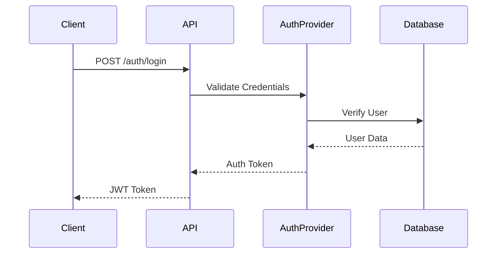

# Simple Authentication Implementation (M1.2)

## Überblick

Dieses Dokument beschreibt den Implementierungsplan für die "Simple Authentication" Komponente als Teil des M1.2 Milestones.

## Implementierungsplan

### 1. Vorbereitende Maßnahmen

- Definition der Auth-Traits im `acci-core` Crate
- Erstellung der notwendigen Datenstrukturen für User-Credentials
- Implementierung der Error-Types für Authentication

### 2. acci-auth Crate Erweiterungen

- Implementierung eines BasicAuthProvider
- JWT Token Generierung und Validierung
- Middleware für Authentication-Checks
- In-Memory Storage für den Test-User (wie im Milestone definiert)

### 3. API Integration (acci-api)

- Login Endpoint (`POST /auth/login`)
- Session Management
- CORS-Konfiguration für Auth-Endpoints
- Rate Limiting für Auth-Endpoints

### 4. Datenbankanbindung (acci-db)

- Erweiterung des User-Schemas um Auth-relevante Felder
- Repository-Methoden für User-Authentication
- Test-User Seed-Daten

### 5. Testing

- Unit Tests für Auth-Provider
- Integration Tests für Login-Flow
- Security Tests (Basic Penetration Testing)
- Performance Tests für Auth-Endpoints

## Technische Details

### Authentication Flow

### Benötigte Dependencies

- `jsonwebtoken` für JWT Handling
- `argon2` für Password Hashing
- `time` für Token Expiration
- `rand` für Secret Generation

### Sicherheitsaspekte

- Implementierung von Rate Limiting
- Secure Headers
- CSRF Protection
- Proper Error Handling ohne Information Leakage

## Offene Fragen

1. OAuth/Social Login Vorbereitung für spätere Phasen?
2. Konkrete Session Management Strategie?
3. Definierte Felder für Test-User?
4. Multi-Factor Authentication Vorbereitung?

## Nächste Schritte

1. Review des Plans
2. Priorisierung der Komponenten
3. Definition der API-Schnittstellen
4. Festlegung der Test-Strategie
5. Dokumentationsstruktur erstellen
