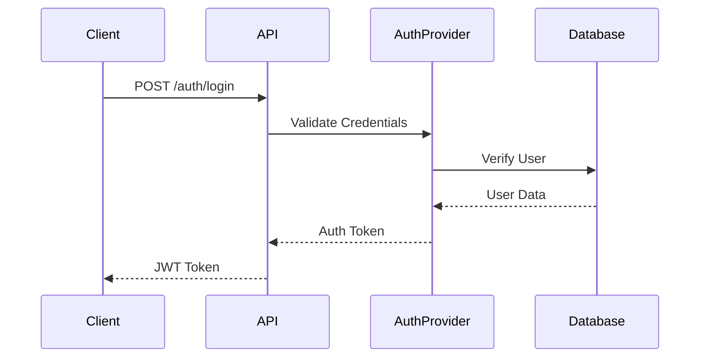

# Simple Authentication Implementation (M1.2)

## Overview

This document describes the implementation plan for the "Simple Authentication" component as part of the M1.2 milestone.

## Implementation Plan

### 1. Preparatory Measures

- Definition of Auth traits in the `acci-core` crate
- Creation of necessary data structures for user credentials
- Implementation of authentication error types

### 2. acci-auth Crate Extensions

- Implementation of a BasicAuthProvider
- JWT token generation and validation
- Middleware for authentication checks
- In-memory storage for test user (as defined in milestone)

### 3. API Integration (acci-api)

- Login endpoint (`POST /auth/login`)
- Session management
- CORS configuration for auth endpoints
- Rate limiting for auth endpoints

### 4. Database Integration (acci-db)

- Extension of user schema with auth-relevant fields
- Repository methods for user authentication
- Test user seed data

### 5. Testing

- Unit tests for auth provider
- Integration tests for login flow
- Security tests (basic penetration testing)
- Performance tests for auth endpoints

## Technical Details

### Authentication Flow

### Required Dependencies

- `jsonwebtoken` for JWT handling
- `argon2` for password hashing
- `time` for token expiration
- `rand` for secret generation

### Security Aspects

- Implementation of rate limiting
- Secure headers
- CSRF protection
- Proper error handling without information leakage

## Open Questions

1. Preparation for OAuth/Social login in later phases?
2. Concrete session management strategy?
3. Defined fields for test user?
4. Multi-factor authentication preparation?

## Next Steps

1. Review of the plan
2. Prioritization of components
3. Definition of API interfaces
4. Establishment of test strategy
5. Documentation structure creation
