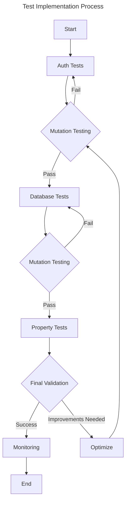

# Mutation Testing Improvement Plan

## Overview

This plan addresses the critical areas identified through mutation test analysis, focusing on immediate improvement of the test suite, particularly in security-critical areas. The plan leverages the existing mutation testing infrastructure using `cargo-mutants` and established CI/CD pipeline.

## 1. Current Infrastructure

### 1.1 Existing Setup

- `cargo-mutants` is installed locally
- GitHub Actions workflow is configured with:
  - Configurable timeout (default: 600s)
  - Parallel execution (default: 4 threads)
  - Prometheus metrics integration
  - Detailed reporting with artifacts
  - Mutation score threshold of 80%

### 1.2 Configuration Improvements

Current `.mutants.toml` configuration should be aligned with the CI configuration:

```toml
# Align with CI settings
timeout = 600  # 10 minutes per mutation
threads = 4    # Match CI parallel execution

# Mutation operators (from CI config)
[[operators]]
name = "arithmetic"
enabled = true

[[operators]]
name = "conditional"
enabled = true

[[operators]]
name = "function"
enabled = true

# Exclusions (from CI config)
exclude = [
    "**/tests/**",
    "**/generated/**",
    "**/migrations/**"
]
```

## 2. Test Implementation Priority

### 2.1 Authentication Tests (Week 1)

#### Token Validation

```rust
#[test]
fn test_token_validation() {
    // Happy Path
    let token = create_valid_token();
    assert!(validate_token(&token).is_ok());
    
    // Edge Cases
    assert!(validate_token("").is_err());
    assert!(validate_token(&"a".repeat(1000)).is_err());
    
    // Token Format
    let result = create_token(user_id);
    assert_matches!(result, Ok(token) if token.len() >= 32);
    assert_matches!(result, Ok(token) if token.chars().all(|c| c.is_ascii()));
    
    // Mutation Coverage
    let invalid_token = "invalid.token.format";
    assert!(validate_token(invalid_token).is_err());
    assert!(validate_token(&token[..token.len()-1]).is_err());
}
```

#### Password Hashing

```rust
#[test]
fn test_password_hashing() {
    let password = "secure_password";
    
    // Basic Validation
    let hash = hash_password(password)?;
    assert!(verify_password(password, &hash)?);
    
    // Timing Attacks
    let start = Instant::now();
    let _ = verify_password(password, &hash);
    let valid_time = start.elapsed();
    
    let start = Instant::now();
    let _ = verify_password("wrong_password", &hash);
    let invalid_time = start.elapsed();
    
    // Time difference should be minimal
    assert!(
        (valid_time.as_nanos() as i128 - invalid_time.as_nanos() as i128).abs() < 1000
    );
    
    // Mutation Coverage
    assert!(!verify_password("", &hash)?);
    assert!(!verify_password(password, "")?);
    assert!(!verify_password(&password[..password.len()-1], &hash)?);
}
```

### 2.2 Database Operations (Week 2)

```rust
#[test]
async fn test_user_repository() {
    // Create
    let user = create_test_user();
    let result = repo.create_user(&user).await?;
    assert!(result.id > 0);
    
    // Read
    let found = repo.find_user_by_email(&user.email).await?;
    assert_eq!(found.email, user.email);
    
    // Update
    user.name = "Updated Name".to_string();
    repo.update_user(&user).await?;
    let updated = repo.find_user_by_id(user.id).await?;
    assert_eq!(updated.name, "Updated Name");
    
    // Delete
    repo.delete_user(user.id).await?;
    let not_found = repo.find_user_by_id(user.id).await?;
    assert!(not_found.is_none());
    
    // Mutation Coverage
    assert!(repo.find_user_by_email("").await.is_err());
    assert!(repo.find_user_by_id(0).await?.is_none());
}
```

### 2.3 Property-Based Testing (Week 3)

```rust
use proptest::prelude::*;

proptest! {
    #[test]
    fn test_comparison_properties(
        a in any::<String>(),
        b in any::<String>(),
        c in any::<String>()
    ) {
        // Commutativity
        prop_assert_eq!(a == b, b == a);
        
        // Transitivity
        if a == b && b == c {
            prop_assert_eq!(a, c);
        }
        
        // Reflexivity
        prop_assert_eq!(a, a);
    }
}

proptest! {
    #[test]
    fn test_password_validation(
        password in "[A-Za-z0-9]{8,100}"
    ) {
        // Length Validation
        prop_assert!(password.len() >= MIN_PASSWORD_LENGTH);
        
        // Complexity Requirements
        prop_assert!(contains_required_chars(&password));
        
        // Hash Consistency
        let hash = hash_password(&password)?;
        prop_assert!(verify_password(&password, &hash)?);
        
        // Mutation Coverage
        prop_assert!(!verify_password(&password[..password.len()-1], &hash)?);
        prop_assert!(!verify_password(&format!("{}a", password), &hash)?);
    }
}
```

## 3. Implementation Schedule

### Week 1: Authentication Focus

- [ ] Implement token validation tests
- [ ] Implement password hashing tests
- [ ] Add timing attack prevention tests
- [ ] Run mutation tests on auth module

### Week 2: Database Layer

- [ ] Implement repository CRUD tests
- [ ] Add edge case coverage
- [ ] Test transaction behaviors
- [ ] Run mutation tests on db module

### Week 3: Property Testing

- [ ] Add proptest dependency
- [ ] Implement comparison property tests
- [ ] Add security property tests
- [ ] Run mutation tests with property tests

### Week 4: Integration and Optimization

- [ ] Run full mutation test suite
- [ ] Analyze surviving mutants
- [ ] Optimize test performance
- [ ] Update documentation

## 4. Success Metrics

### 4.1 Coverage Goals

- [ ] Overall mutation score > 80% (CI requirement)
- [ ] Auth module score > 95%
- [ ] Database module score > 90%
- [ ] No critical surviving mutants

### 4.2 Performance Goals

- [ ] Individual mutations complete within 600s timeout
- [ ] Full suite runs within CI resource limits
- [ ] Property tests complete in reasonable time
- [ ] Constant-time crypto operations verified

## 5. Monitoring Plan

### Daily

- Review CI mutation test results
- Address any failing mutations
- Monitor test execution times

### Weekly

- Full mutation test analysis
- Update test cases based on survivors
- Performance optimization if needed

### Monthly

- Comprehensive coverage review
- Pattern analysis of survivors
- Documentation updates
- CI configuration review


