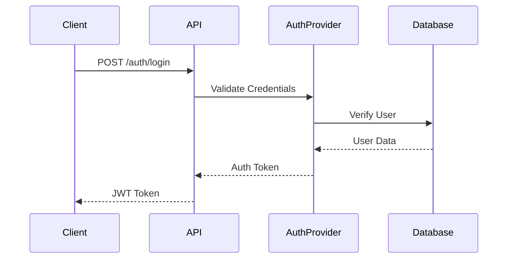

# Implementimi i Autentifikimit të Thjeshtë (M1.2)

## Përmbledhje

Ky dokument përshkruan planin e implementimit për komponentin "Simple Authentication" si pjesë e fazës M1.2.

## Plani i Implementimit

### 1. Masat Përgatitore

- Përkufizimi i Auth traits në `acci-core` crate
- Krijimi i strukturave të nevojshme të të dhënave për kredencialet e përdoruesit
- Implementimi i tipeve të gabimeve për autentifikim

### 2. Zgjerimet e acci-auth Crate

- Implementimi i BasicAuthProvider
- Gjenerimi dhe validimi i token-it JWT
- Middleware për kontrollet e autentifikimit
- Ruajtja në memorie për përdoruesin test (siç është përcaktuar në milestone)

### 3. Integrimi i API (acci-api)

- Endpoint-i i login-it (`POST /auth/login`)
- Menaxhimi i sesionit
- Konfigurimi CORS për endpoint-et e auth
- Rate limiting për endpoint-et e auth

### 4. Integrimi i Bazës së të Dhënave (acci-db)

- Zgjerimi i skemës së përdoruesit me fushat e autentifikimit
- Metodat e repository për autentifikimin e përdoruesit
- Të dhënat seed për përdoruesin test

### 5. Testimi

- Unit testet për auth provider
- Testet e integrimit për rrjedhën e login-it
- Testet e sigurisë (testim bazik i penetrimit)
- Testet e performancës për endpoint-et e auth

## Detajet Teknike

### Rrjedha e Autentifikimit

### Dependencies të Nevojshme

- `jsonwebtoken` për menaxhimin e JWT
- `argon2` për hash-imin e fjalëkalimeve
- `time` për skadimin e token-it
- `rand` për gjenerimin e sekreteve

### Aspektet e Sigurisë

- Implementimi i rate limiting
- Headers të sigurta
- Mbrojtja CSRF
- Trajtimi i duhur i gabimeve pa rrjedhje informacioni

## Pyetje të Hapura

1. Përgatitja për OAuth/Social login në fazat e mëvonshme?
2. Strategjia konkrete e menaxhimit të sesionit?
3. Fushat e përcaktuara për përdoruesin test?
4. Përgatitja për autentifikim me shumë faktorë?

## Hapat e Ardhshëm

1. Rishikimi i planit
2. Prioritizimi i komponentëve
3. Përcaktimi i ndërfaqeve API
4. Vendosja e strategjisë së testimit
5. Krijimi i strukturës së dokumentacionit
