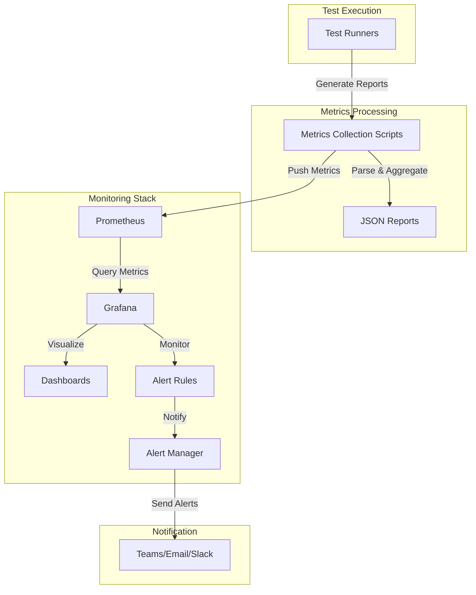

# Test Metrics System Documentation

## Overview

The test metrics system provides comprehensive monitoring and reporting of test quality metrics across the ACCI project. It includes coverage tracking, mutation testing, performance monitoring, and integration with Prometheus and Grafana for visualization and alerting.

## System Architecture



## Components

### 1. Configuration

The test metrics system is configuration-driven, with all thresholds and settings defined in `config/test-metrics.json`.

#### Configuration Structure

```json
{
    "coverage": {
        "total": {
            "threshold": 80,
            "description": "Minimum total code coverage percentage"
        },
        "critical": {
            "threshold": 95,
            "description": "Minimum coverage for critical paths"
        }
    },
    "components": {
        "auth": {
            "coverage": {
                "threshold": 95,
                "description": "Minimum coverage for auth component"
            }
        }
    }
}
```

#### Configurable Thresholds

- **Coverage Thresholds:**
  - Total coverage (minimum 80%)
  - Critical path coverage (minimum 95%)
  - Function coverage (minimum 85%)
  - Branch coverage (minimum 85%)
  - Component-specific coverage
    - Auth (minimum 95%)
    - Core (minimum 90%)
    - DB (minimum 90%)
    - API (minimum 85%)

- **Mutation Testing Thresholds:**
  - Mutation score (minimum 80%)

- **Performance Thresholds:**
  - Maximum regression (5%)
  - Maximum execution time (300s)
  - Maximum memory usage (1024MB)

### 2. Metrics Collection

The system collects metrics through various test runs and tools:

#### Coverage Metrics

- Total code coverage
- Function coverage
- Branch coverage
- Component-specific coverage
- Critical path coverage

#### Mutation Metrics

- Mutation score
- Number of killed mutations
- Total number of mutations

#### Performance Metrics

- Mean execution time
- Throughput
- Percentiles (p50, p90, p99)
- Memory usage

### 3. Reporting

The system generates comprehensive reports in multiple formats:

#### JSON Report

Generated by `scripts/generate-test-metrics.sh`, includes:

- All collected metrics
- Threshold validation results
- Status information
- Timestamp and context

#### Prometheus Metrics

Exported by `scripts/push-metrics.sh`, includes:

- All metrics in Prometheus format
- Git context (commit, branch)
- Status indicators
- Component-specific metrics

### 4. Visualization

The metrics are visualized in Grafana dashboards. The dashboard definitions can be found in:

- `grafana/dashboards/test-coverage.json` - Test coverage and quality metrics
- `grafana/dashboards/test-performance.json` - Performance metrics

#### Test Quality Dashboard

- Coverage trends
- Mutation score trends
- Performance metrics
- Component-specific metrics
- Status indicators

#### Performance Dashboard

- Execution time trends
- Memory usage
- Throughput
- Percentile distributions

### 5. Alerting

The system includes comprehensive alerting through Grafana. Alert rules are defined in `grafana/provisioning/alerting/test-metrics.yml`.

#### Alert Rules

- Low code coverage
- Critical path coverage
- Low mutation score
- Mutation score regression
- High execution time (p50, p90, p99)
- High memory usage
- Performance regression
- Flaky tests (rate and count)

#### Adding New Alert Rules

To add a new alert rule:

1. Edit `grafana/provisioning/alerting/test-metrics.yml`:

```yaml
- title: New Alert Name
  condition: metric_name > threshold
  for: 5m
  labels:
    severity: warning
    category: quality
  annotations:
    summary: Alert summary
    description: Detailed description with {{ $value }} placeholder
```

2. Add appropriate notification policy:

```yaml
- name: PolicyName
  group_by: [alertname, category]
  group_wait: 1m
  group_interval: 10m
  repeat_interval: 2h
  contact_points:
    - name: Team Name
      type: email
      settings:
        addresses: [team@example.com]
  match:
    - category: category_name
```

#### Configuring Contact Points

1. In Grafana UI:
   - Navigate to Alerting → Contact points
   - Click "New contact point"
   - Configure email/Slack settings

2. In configuration:

```yaml
contact_points:
  - name: Team Name
    type: email/slack
    settings:
      # Email settings
      addresses: [team@example.com]
      # OR Slack settings
      channel: "#channel-name"
      url: "webhook-url"
```

## Usage

### 1. Running Tests with Metrics

```bash
# Generate coverage report
cargo llvm-cov --lib --bins --all-features --workspace --json --output-path coverage.json

# Run mutation tests
cargo mutants --all --json > mutation-report.json

# Run performance benchmarks
cargo bench --workspace --json > benchmark-results.json

# Generate metrics report
./scripts/generate-test-metrics.sh \
  --coverage coverage.json \
  --mutation mutation-report.json \
  --benchmarks benchmark-results.json \
  --output test-metrics.json
```

### 2. Viewing Results

1. **JSON Report:**

   ```bash
   cat test-metrics.json
   ```

2. **Grafana Dashboard:**
   - Open Grafana (default: <http://localhost:3000>)
   - Navigate to "Test Quality" dashboard
   - View metrics and trends

### 3. Interpreting Results

#### Coverage Metrics

- Green: Above threshold
- Yellow: Within 5% of threshold
- Red: Below threshold

#### Mutation Score

- ≥80%: Good
- 60-80%: Needs improvement
- <60%: Poor

#### Performance Metrics

- Watch for trends in execution time
- Monitor p99 latency for stability
- Check memory usage patterns

#### Flaky Tests

When flaky tests are detected:

1. Check test logs for timing issues
2. Review resource cleanup
3. Check for race conditions
4. Verify test isolation
5. Monitor system resources
6. Consider increasing timeouts
7. Add logging for investigation

## Maintenance

### 1. Regular Tasks

- Review thresholds quarterly
- Update component coverage requirements
- Adjust performance baselines
- Review and update alerting rules

### 2. Threshold Tuning

1. **Analyzing Trends:**
   - Review historical data in Grafana
   - Look for patterns in failures
   - Consider team velocity
   - Account for codebase maturity

2. **Adjusting Thresholds:**

   ```json
   // config/test-metrics.json
   {
     "coverage": {
       "total": {
         "threshold": 85,  // Increased from 80
         "description": "Updated minimum coverage"
       }
     }
   }
   ```

3. **Validating Changes:**
   - Run test suite
   - Check alert triggers
   - Monitor for false positives
   - Gather team feedback

### 3. Troubleshooting

#### Common Issues

1. **Low Coverage:**
   - Check recently added code
   - Review test patterns
   - Look for untested edge cases

2. **Poor Mutation Score:**
   - Review test assertions
   - Check for weak tests
   - Look for missing edge cases

3. **Performance Issues:**
   - Check for slow tests
   - Review resource usage
   - Look for test dependencies

### 4. Customization

#### Adding New Metrics

1. Update collection script:

```bash
# scripts/generate-test-metrics.sh
new_metric=$(calculate_new_metric)
jq --arg val "$new_metric" '.new_metrics.value = $val' "$OUTPUT_FILE"
```

2. Update Prometheus format:

```bash
# scripts/push-metrics.sh
echo "# HELP new_metric_name Description
# TYPE new_metric_name gauge
new_metric_name $new_metric" >> "$TEMP_FILE"
```

3. Add to dashboard:

```json
// grafana/dashboards/test-coverage.json
{
  "panels": [
    {
      "title": "New Metric",
      "targets": [
        {
          "expr": "new_metric_name"
        }
      ]
    }
  ]
}
```

#### Modifying Dashboards

1. Export existing dashboard
2. Modify JSON configuration
3. Import updated dashboard
4. Test visualizations
5. Update documentation

## Integration

### 1. CI/CD Pipeline

The metrics system is integrated into the CI/CD pipeline:

```yaml
jobs:
  test-metrics:
    steps:
      - name: Generate Metrics
        run: ./scripts/generate-test-metrics.sh
      - name: Push to Prometheus
        run: ./scripts/push-metrics.sh
```

### 2. Local Development

Developers can run metrics locally:

```bash
make test-metrics
```

### 3. Monitoring Integration

- Metrics are stored in Prometheus
- Visualized in Grafana
- Alerts sent via configured channels

## Support

For issues or questions:

- DevOps Team: <devops@example.com>
- QA Team: <qa@example.com>
- Performance Team: <performance@example.com>
