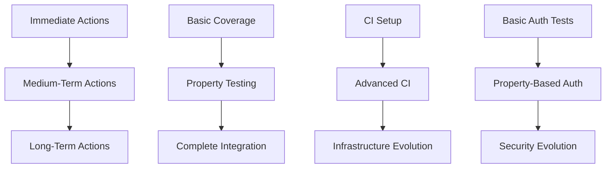

# Test Strategy Integration Overview

## 1. Overview

This document provides a comprehensive overview of how the immediate, medium-term, and long-term test strategy plans integrate and build upon each other for the ACCI project. The goal is to ensure a cohesive and effective testing approach that evolves from basic coverage to advanced quality assurance.



## 2. Phase Transitions and Dependencies

### 2.1 Immediate to Medium-Term

Basic test coverage serves as the foundation for property-based testing:

```rust
// Immediate Phase: Basic Authentication Test
#[test]
fn test_basic_auth_flow() {
    let user = create_test_user();
    let token = authenticate_user(&user);
    assert!(token.is_valid());
}

// Medium-Term Phase: Property-Based Authentication Test
#[test]
fn prop_auth_flow() {
    proptest!(|(user in arbitrary_valid_user())| {
        let token = authenticate_user(&user);
        prop_assert!(token.is_valid());
        prop_assert!(token.expires_in() <= MAX_TOKEN_LIFETIME);
    });
}
```

CI/CD pipeline evolution:

```yaml
# Immediate Phase: Basic Pipeline
name: Basic Tests
on: [push]
jobs:
  test:
    runs-on: ubuntu-latest
    steps:
      - uses: actions/checkout@v4
      - run: cargo test

# Medium-Term Phase: Advanced Pipeline
name: Advanced Tests
on: [push]
jobs:
  test:
    runs-on: ubuntu-latest
    steps:
      - uses: actions/checkout@v4
      - run: cargo test
      - run: cargo test --test '*_prop'  # Property tests
      - run: cargo mutants              # Mutation tests
      - uses: actions/upload-artifact@v4
        with:
          name: test-results
          path: target/test-results/
```

### 2.2 Medium-Term to Long-Term

Property-based tests evolve into comprehensive security testing:

```rust
// Medium-Term Phase: Basic Property Test
#[test]
fn prop_input_validation() {
    proptest!(|(input in arbitrary_string())| {
        let result = validate_input(&input);
        prop_assert!(!result.contains_xss());
    });
}

// Long-Term Phase: Advanced Security Property Test
#[test]
fn prop_security_properties() {
    proptest!(|(input in arbitrary_string(), user in arbitrary_user())| {
        let context = SecurityContext::new(user);
        let result = validate_input_with_context(&input, &context);
        prop_assert!(!result.contains_xss());
        prop_assert!(!result.contains_sqli());
        prop_assert!(result.respects_rbac());
        prop_assert!(result.audit_trail_complete());
    });
}
```

## 3. Resource Allocation

### 3.1 Team Roles and Time Allocation

| Role | Immediate | Medium-Term | Long-Term |
|------|-----------|-------------|------------|
| Test Engineer (2 FTE) | 100% | 80% | 60% |
| DevOps Engineer (1 FTE) | 50% | 70% | 40% |
| Security Engineer (1 FTE) | 20% | 40% | 60% |
| Test Lead (1 FTE) | 100% | 100% | 100% |

### 3.2 Infrastructure Requirements

| Phase | CI Runners | Test Clusters | Estimated Monthly Cost |
|-------|------------|---------------|----------------------|
| Immediate | 2 runners | 1 small cluster | $200-300 |
| Medium-Term | 4 runners | 2 medium clusters | $500-700 |
| Long-Term | 8 runners | 3 large clusters | $1000-1500 |

## 4. Risk Management

### 4.1 Cross-Phase Risks

| Risk | Impact | Mitigation |
|------|---------|------------|
| Test Flakiness | Reduced confidence | Implement retry mechanism and detailed logging |
| Resource Constraints | Delayed implementation | Clear prioritization and phased rollout |
| Knowledge Gap | Implementation delays | Regular training sessions and documentation |

### 4.2 Phase-Specific Risks

#### Immediate Phase

- **Risk**: Incomplete coverage
- **Impact**: Missed critical paths
- **Mitigation**:

  ```rust
  // Coverage validation in CI
  #[test]
  #[coverage(minimum = "80")]
  fn validate_coverage() {
      assert!(coverage_percentage() >= 80.0);
  }
  ```

#### Medium-Term Phase

- **Risk**: Complex property tests timeout
- **Impact**: CI pipeline delays
- **Mitigation**:

  ```rust
  // Timeout configuration
  #[test]
  #[timeout(5000)]
  fn prop_with_timeout() {
      proptest!(|(input in arbitrary_complex_input())| {
          prop_assert!(validate_complex_input(&input));
      });
  }
  ```

#### Long-Term Phase

- **Risk**: Security vulnerability in test infrastructure
- **Impact**: Potential system compromise
- **Mitigation**:

  ```rust
  // Regular security scanning
  #[test]
  fn security_scan() {
      let scan_result = security_scanner::scan_infrastructure();
      assert!(scan_result.vulnerabilities.is_empty());
  }
  ```

## 5. Success Metrics

### 5.1 Metric Evolution

| Metric | Immediate | Medium-Term | Long-Term |
|--------|-----------|-------------|------------|
| Coverage | 80% | 85% | 90% |
| Mutation Score | N/A | 70% | 85% |
| Property Test Pass Rate | N/A | 95% | 98% |
| Security Score | Basic | Advanced | Comprehensive |
| Performance (Test Execution) | < 10min | < 20min | < 30min |
| Documentation Completeness | 70% | 85% | 95% |

### 5.2 Evaluation Criteria

Each phase has specific evaluation criteria that must be met before proceeding:

```rust
// Example evaluation check
fn evaluate_phase_completion(phase: Phase) -> bool {
    match phase {
        Phase::Immediate => {
            coverage_percentage() >= 80.0 
            && ci_pipeline_success_rate() >= 95.0
            && documentation_coverage() >= 70.0
        },
        Phase::MediumTerm => {
            property_test_pass_rate() >= 95.0 
            && mutation_score() >= 70.0
            && security_score() >= SecurityLevel::Advanced
        },
        Phase::LongTerm => {
            coverage_percentage() >= 90.0 
            && mutation_score() >= 85.0
            && security_score() >= SecurityLevel::Comprehensive
        }
    }
}
```

## 6. Integration with Infrastructure

### 6.1 Observability Integration

```yaml
# Prometheus metrics configuration
metrics:
  - name: test_execution_time
    type: gauge
    labels:
      - phase
      - test_type
  - name: test_coverage
    type: gauge
    labels:
      - component
      - test_type
  - name: security_score
    type: gauge
    labels:
      - component
      - check_type

# Grafana dashboard configuration
dashboards:
  - name: Test Quality Overview
    panels:
      - title: Coverage Trends
        type: graph
        metrics:
          - test_coverage{test_type="unit"}
          - test_coverage{test_type="property"}
      - title: Security Metrics
        type: gauge
        metrics:
          - security_score
```

### 6.2 Alert Configuration

```yaml
alerts:
  - name: LowTestCoverage
    condition: test_coverage < 80
    severity: warning
  - name: HighTestFailureRate
    condition: test_failure_rate > 5
    severity: critical
  - name: SecurityScoreDropped
    condition: security_score < previous_day
    severity: critical
```

## 7. Related Documents

- [Immediate Actions Plan](../immediate-actions-plan.md)
- [Medium-Term Actions Plan](../medium-term-actions-plan.md)
- [Long-Term Actions Plan](../long-term-actions-plan.md)
- [Observability Infrastructure](../infrastructure/observability.md)
- [Integration Tests](./Integration_Tests.md)
- [Test Coverage Improvement Plan](./test-coverage-improvement-plan.md)
- [Property-Based Testing Plan](./property-based-testing-plan.md)
- [Mutation Testing Plan](./mutation-testing-plan.md)

## 8. Maintenance and Updates

This document should be reviewed and updated:

- Weekly during the Immediate phase
- Bi-weekly during the Medium-term phase
- Monthly during the Long-term phase

Changes should be tracked in the repository's CHANGELOG.md under the [Unreleased] section.
